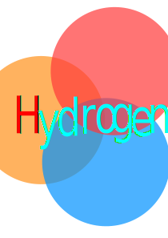

<div style="text-align: center">
# HydrogenLib
</div>



<div style="text-align: center">

[](https://pypi.org/project/hydrogenlib)
[](https://pypi.org/project/hydrogenlib)
[](https://github.com/SongzqInChina/HydrogenLib)

</div>

[//]: # ([![Action Status]&#40;https://github.com/SongzqInChina/HydrogenLib/actions/workflows/python-publish.yml/badge.svg&#41;]&#40;)

[//]: # (    https://github.com/SongzqInChina/HydrogenLib/actions&#41;)

---

当前为测试(`<= 2.0.0`)版本,功能可能有**缺失,不完整或错误**,详细请见[注意事项](#注意事项)


## 目录

- [安装](#安装)
- [许可证](#许可证)
- [注意事项](#注意事项)

## 安装

```shell
  pip install HydrogenLib
```

## 注意事项
- 项目的实际开发Python版本为**3.12+**,可能无法运行于低于3.12的Python版本.
- `.database` 只是一个简单的基于单JSON文件的轻量级数据库，可能不适用于所有使用场景.
- `.namedpipe` 为非Windows系统的支持未完成.
- `.re_plus` 实现较为简单，可能无法完全满足需求.
- `.hyconfig` 未完成，且无法使用.
- `.test_manager` 将会在未来版本移除.
- `.hystruct`, `.file`等模块整改,相关功能暂时不兼容.
- 目前所有使用Socket的模块无法使用(**正在整改**)
- 对于有关IO功能的函数和类,大多使用了异步模式，请注意兼容性.

- 代码实现中大部分有关序列化和反序列化的操作，均使用`jsonpickle`模块，可能有安全风险(**正在整改,将支持自定义序列化器**).
- **所有模块均未进行测试.**

## 许可证

项目使用[`HydrogenLib License`](License.md)许可证.
